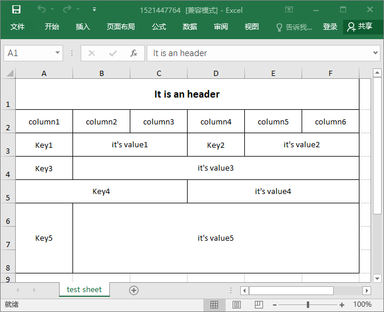

## Awesome export excel

It's an easier way to export an excel. you don't need to worry about the detail, the default style of excel is enough for you.

### Install

```console
composer require fengxw/awesome-export-excel
```

### Usage

```php
// define the arguments.
$header = 'It is a header';
$title = ['column1', 'column2'];
$data = [['value1', 'value2']];

// export excel
ExportExcel::getInstance()->export($header, $title, $data);
```


Maybe you has a complex form need to export, then you can check the examples and build the sheet as you want.

